<h1 align="center">
  127 Scientific Diagrams
</h1>

<h4 align="center">
  Illustrating concepts in physics, chemistry and machine learning.
</h4>

<h3 align="center">

[](https://typst.app)
[](https://latex-project.org)
[](https://github.com/janosh/diagrams/actions/workflows/gh-pages.yml)
[](https://github.com/janosh/diagrams/pulls)
[](https://zenodo.org/badge/latestdoi/286220365)

</h3>

[janosh.github.io/diagrams](https://janosh.github.io/diagrams) allows searching, sorting, opening in Overleaf and downloading figures (PDF/SVG/PNG) from this collection.

Have a TikZ/CeTZ diagram you'd like to share? [Submit a PR](https://github.com/janosh/diagrams/pulls) with a `.tex` or `.typ` and a corresponding metadata `.yml` file in the `assets/` directory and add yourself to the [`citation.cff`](citation.cff) file.

<!-- diagram-table -->

| &emsp;&emsp;&emsp;&emsp;&emsp;&emsp;&emsp;&emsp;&emsp;&emsp;&emsp;&emsp;&emsp;&emsp;&emsp;&emsp;&emsp;&emsp;&emsp;&emsp;&emsp;&emsp; | &emsp;&emsp;&emsp;&emsp;&emsp;&emsp;&emsp;&emsp;&emsp;&emsp;&emsp;&emsp;&emsp;&emsp;&emsp;&emsp;&emsp;&emsp;&emsp;&emsp;&emsp;&emsp; |
| :---: | :---: |
| [2d Convolution](https://janosh.github.io/diagrams/2d-convolution) &nbsp;[![LaTeX][latex-logo]](assets/2d-convolution/2d-convolution.tex)&nbsp;[![Typst][typst-logo]](assets/2d-convolution/2d-convolution.typ) | [Angular Momentum Quantization](https://janosh.github.io/diagrams/angular-momentum-quantization) &nbsp;[![Typst][typst-logo]](assets/angular-momentum-quantization/angular-momentum-quantization.typ) |
|  | 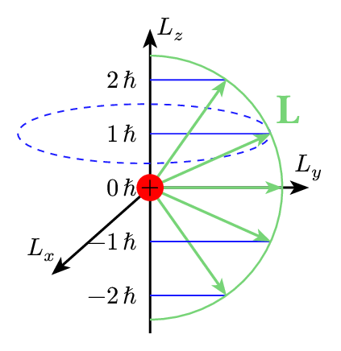 |
| [Atomistic GPU Batching](https://janosh.github.io/diagrams/atomistic-gpu-batching) &nbsp;[![Typst][typst-logo]](assets/atomistic-gpu-batching/atomistic-gpu-batching.typ) | [Autoencoder](https://janosh.github.io/diagrams/autoencoder) &nbsp;[![LaTeX][latex-logo]](assets/autoencoder/autoencoder.tex)&nbsp;[![Typst][typst-logo]](assets/autoencoder/autoencoder.typ) |
| 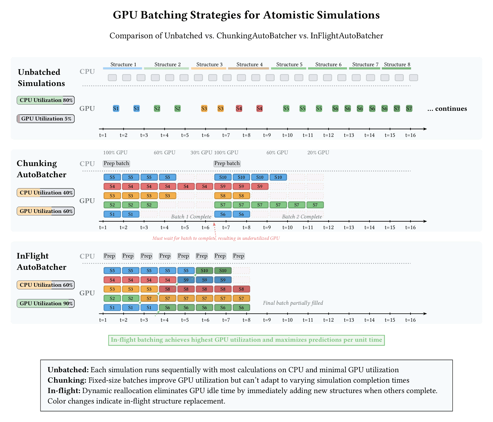 |  |
| [Ball Tree](https://janosh.github.io/diagrams/ball-tree) &nbsp;[![Typst][typst-logo]](assets/ball-tree/ball-tree.typ) | [Basis + Lattice](https://janosh.github.io/diagrams/basis-plus-lattice) &nbsp;[![LaTeX][latex-logo]](assets/basis-plus-lattice/basis-plus-lattice.tex)&nbsp;[![Typst][typst-logo]](assets/basis-plus-lattice/basis-plus-lattice.typ) |
| 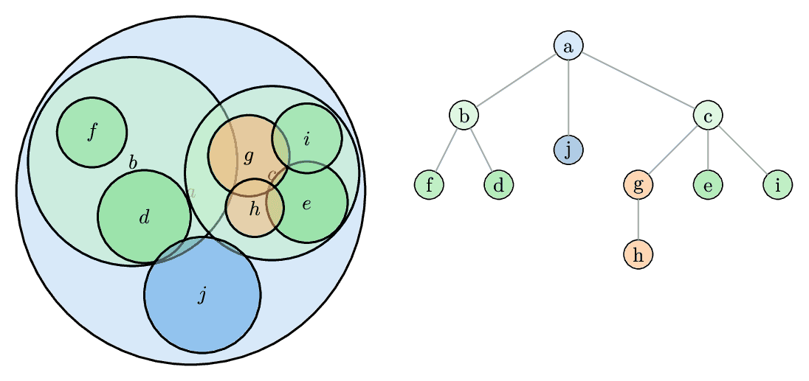 |  |
| [Bloch Sphere](https://janosh.github.io/diagrams/bloch-sphere) &nbsp;[![LaTeX][latex-logo]](assets/bloch-sphere/bloch-sphere.tex)&nbsp;[![Typst][typst-logo]](assets/bloch-sphere/bloch-sphere.typ) | [Bose Einstein Distribution](https://janosh.github.io/diagrams/bose-einstein-distribution) &nbsp;[![LaTeX][latex-logo]](assets/bose-einstein-distribution/bose-einstein-distribution.tex)&nbsp;[![Typst][typst-logo]](assets/bose-einstein-distribution/bose-einstein-distribution.typ) |
|  |  |
| [Bose Einstein Distribution 3d](https://janosh.github.io/diagrams/bose-einstein-distribution-3d) &nbsp;[![LaTeX][latex-logo]](assets/bose-einstein-distribution-3d/bose-einstein-distribution-3d.tex) | [Branch and Bound](https://janosh.github.io/diagrams/branch-and-bound) &nbsp;[![LaTeX][latex-logo]](assets/branch-and-bound/branch-and-bound.tex)&nbsp;[![Typst][typst-logo]](assets/branch-and-bound/branch-and-bound.typ) |
|  |  |
| [Branch Cuts 1](https://janosh.github.io/diagrams/branch-cuts-1) &nbsp;[![LaTeX][latex-logo]](assets/branch-cuts-1/branch-cuts-1.tex)&nbsp;[![Typst][typst-logo]](assets/branch-cuts-1/branch-cuts-1.typ) | [Branch Cuts 2](https://janosh.github.io/diagrams/branch-cuts-2) &nbsp;[![LaTeX][latex-logo]](assets/branch-cuts-2/branch-cuts-2.tex)&nbsp;[![Typst][typst-logo]](assets/branch-cuts-2/branch-cuts-2.typ) |
|  |  |
| [Change of Variables](https://janosh.github.io/diagrams/change-of-variables) &nbsp;[![LaTeX][latex-logo]](assets/change-of-variables/change-of-variables.tex)&nbsp;[![Typst][typst-logo]](assets/change-of-variables/change-of-variables.typ) | [Closed String Topologies](https://janosh.github.io/diagrams/closed-string-topologies) &nbsp;[![LaTeX][latex-logo]](assets/closed-string-topologies/closed-string-topologies.tex) |
|  |  |
| [Complex Sign Function](https://janosh.github.io/diagrams/complex-sign-function) &nbsp;[![LaTeX][latex-logo]](assets/complex-sign-function/complex-sign-function.tex)&nbsp;[![Typst][typst-logo]](assets/complex-sign-function/complex-sign-function.typ) | [Complex Sign Plane](https://janosh.github.io/diagrams/complex-sign-plane) &nbsp;[![LaTeX][latex-logo]](assets/complex-sign-plane/complex-sign-plane.tex)&nbsp;[![Typst][typst-logo]](assets/complex-sign-plane/complex-sign-plane.typ) |
|  |  |
| [Concave Functions](https://janosh.github.io/diagrams/concave-functions) &nbsp;[![LaTeX][latex-logo]](assets/concave-functions/concave-functions.tex)&nbsp;[![Typst][typst-logo]](assets/concave-functions/concave-functions.typ) | [Convex Functions](https://janosh.github.io/diagrams/convex-functions) &nbsp;[![LaTeX][latex-logo]](assets/convex-functions/convex-functions.tex)&nbsp;[![Typst][typst-logo]](assets/convex-functions/convex-functions.typ) |
|  |  |
| [Convex Hull of Stability](https://janosh.github.io/diagrams/convex-hull-of-stability) &nbsp;[![LaTeX][latex-logo]](assets/convex-hull-of-stability/convex-hull-of-stability.tex)&nbsp;[![Typst][typst-logo]](assets/convex-hull-of-stability/convex-hull-of-stability.typ) | [Critical Temperature](https://janosh.github.io/diagrams/critical-temperature) &nbsp;[![LaTeX][latex-logo]](assets/critical-temperature/critical-temperature.tex)&nbsp;[![Typst][typst-logo]](assets/critical-temperature/critical-temperature.typ) |
|  |  |
| [Cylinder to Plane](https://janosh.github.io/diagrams/cylinder-to-plane) &nbsp;[![LaTeX][latex-logo]](assets/cylinder-to-plane/cylinder-to-plane.tex)&nbsp;[![Typst][typst-logo]](assets/cylinder-to-plane/cylinder-to-plane.typ) | [DFT Choices](https://janosh.github.io/diagrams/dft-choices) &nbsp;[![LaTeX][latex-logo]](assets/dft-choices/dft-choices.tex)&nbsp;[![Typst][typst-logo]](assets/dft-choices/dft-choices.typ) |
|  |  |
| [DFT Jacob's Ladder](https://janosh.github.io/diagrams/dft-jacobs-ladder) &nbsp;[![Typst][typst-logo]](assets/dft-jacobs-ladder/dft-jacobs-ladder.typ) | [DFT MLFF CFF Speed Accuracy Transfer](https://janosh.github.io/diagrams/dft-mlff-cff-speed-accuracy-transfer) &nbsp;[![LaTeX][latex-logo]](assets/dft-mlff-cff-speed-accuracy-transfer/dft-mlff-cff-speed-accuracy-transfer.tex)&nbsp;[![Typst][typst-logo]](assets/dft-mlff-cff-speed-accuracy-transfer/dft-mlff-cff-speed-accuracy-transfer.typ) |
|  |  |
| [Disk to Plane](https://janosh.github.io/diagrams/disk-to-plane) &nbsp;[![LaTeX][latex-logo]](assets/disk-to-plane/disk-to-plane.tex)&nbsp;[![Typst][typst-logo]](assets/disk-to-plane/disk-to-plane.typ) | [Divergence](https://janosh.github.io/diagrams/divergence) &nbsp;[![LaTeX][latex-logo]](assets/divergence/divergence.tex)&nbsp;[![Typst][typst-logo]](assets/divergence/divergence.typ) |
|  |  |
| [Dropout](https://janosh.github.io/diagrams/dropout) &nbsp;[![LaTeX][latex-logo]](assets/dropout/dropout.tex)&nbsp;[![Typst][typst-logo]](assets/dropout/dropout.typ) | [Ergodic](https://janosh.github.io/diagrams/ergodic) &nbsp;[![LaTeX][latex-logo]](assets/ergodic/ergodic.tex)&nbsp;[![Typst][typst-logo]](assets/ergodic/ergodic.typ) |
|  |  |
| [Euler Angles](https://janosh.github.io/diagrams/euler-angles) &nbsp;[![LaTeX][latex-logo]](assets/euler-angles/euler-angles.tex) | [Fermi-Dirac Distribution](https://janosh.github.io/diagrams/fermi-dirac-distro) &nbsp;[![LaTeX][latex-logo]](assets/fermi-dirac-distro/fermi-dirac-distro.tex)&nbsp;[![Typst][typst-logo]](assets/fermi-dirac-distro/fermi-dirac-distro.typ) |
|  |  |
| [Ferroelectric Response](https://janosh.github.io/diagrams/ferroelectric-response) &nbsp;[![LaTeX][latex-logo]](assets/ferroelectric-response/ferroelectric-response.tex)&nbsp;[![Typst][typst-logo]](assets/ferroelectric-response/ferroelectric-response.typ) | [Feynman Diagram 1](https://janosh.github.io/diagrams/feynman-diagram-1) &nbsp;[![LaTeX][latex-logo]](assets/feynman-diagram-1/feynman-diagram-1.tex)&nbsp;[![Typst][typst-logo]](assets/feynman-diagram-1/feynman-diagram-1.typ) |
|  |  |
| [Feynman Diagram 2](https://janosh.github.io/diagrams/feynman-diagram-2) &nbsp;[![LaTeX][latex-logo]](assets/feynman-diagram-2/feynman-diagram-2.tex)&nbsp;[![Typst][typst-logo]](assets/feynman-diagram-2/feynman-diagram-2.typ) | [Feynman Diagram 3](https://janosh.github.io/diagrams/feynman-diagram-3) &nbsp;[![LaTeX][latex-logo]](assets/feynman-diagram-3/feynman-diagram-3.tex)&nbsp;[![Typst][typst-logo]](assets/feynman-diagram-3/feynman-diagram-3.typ) |
|  |  |
| [Feynman Diagram 4](https://janosh.github.io/diagrams/feynman-diagram-4) &nbsp;[![LaTeX][latex-logo]](assets/feynman-diagram-4/feynman-diagram-4.tex)&nbsp;[![Typst][typst-logo]](assets/feynman-diagram-4/feynman-diagram-4.typ) | [Feynman Diagram Loop](https://janosh.github.io/diagrams/feynman-diagram-loop) &nbsp;[![LaTeX][latex-logo]](assets/feynman-diagram-loop/feynman-diagram-loop.tex)&nbsp;[![Typst][typst-logo]](assets/feynman-diagram-loop/feynman-diagram-loop.typ) |
|  |  |
| [Feynman Diagram Loops](https://janosh.github.io/diagrams/feynman-diagram-loops) &nbsp;[![LaTeX][latex-logo]](assets/feynman-diagram-loops/feynman-diagram-loops.tex) | [Feynman Diagram One Point](https://janosh.github.io/diagrams/feynman-diagram-one-point) &nbsp;[![LaTeX][latex-logo]](assets/feynman-diagram-one-point/feynman-diagram-one-point.tex)&nbsp;[![Typst][typst-logo]](assets/feynman-diagram-one-point/feynman-diagram-one-point.typ) |
|  |  |
| [Feynman Diagram Propagator Loop](https://janosh.github.io/diagrams/feynman-diagram-propagator-loop) &nbsp;[![LaTeX][latex-logo]](assets/feynman-diagram-propagator-loop/feynman-diagram-propagator-loop.tex)&nbsp;[![Typst][typst-logo]](assets/feynman-diagram-propagator-loop/feynman-diagram-propagator-loop.typ) | [Feynman Diagrams Loop Regulator](https://janosh.github.io/diagrams/feynman-diagrams-loop-regulator) &nbsp;[![LaTeX][latex-logo]](assets/feynman-diagrams-loop-regulator/feynman-diagrams-loop-regulator.tex)&nbsp;[![Typst][typst-logo]](assets/feynman-diagrams-loop-regulator/feynman-diagrams-loop-regulator.typ) |
|  |  |
| [Four Vs of Data](https://janosh.github.io/diagrams/four-vs-of-data) &nbsp;[![LaTeX][latex-logo]](assets/four-vs-of-data/four-vs-of-data.tex)&nbsp;[![Typst][typst-logo]](assets/four-vs-of-data/four-vs-of-data.typ) | [Gas Pressure on Wall](https://janosh.github.io/diagrams/gas-pressure-on-wall) &nbsp;[![LaTeX][latex-logo]](assets/gas-pressure-on-wall/gas-pressure-on-wall.tex)&nbsp;[![Typst][typst-logo]](assets/gas-pressure-on-wall/gas-pressure-on-wall.typ) |
|  |  |
| [Generative Adversarial Network](https://janosh.github.io/diagrams/generative-adversarial-network) &nbsp;[![LaTeX][latex-logo]](assets/generative-adversarial-network/generative-adversarial-network.tex)&nbsp;[![Typst][typst-logo]](assets/generative-adversarial-network/generative-adversarial-network.typ) | [Geometric Bayes](https://janosh.github.io/diagrams/geometric-bayes) &nbsp;[![LaTeX][latex-logo]](assets/geometric-bayes/geometric-bayes.tex)&nbsp;[![Typst][typst-logo]](assets/geometric-bayes/geometric-bayes.typ) |
|  |  |
| [GNN Node Aggregation](https://janosh.github.io/diagrams/gnn-node-aggregation) &nbsp;[![Typst][typst-logo]](assets/gnn-node-aggregation/gnn-node-aggregation.typ) | [Grand Canonical Occupation Fluctuations](https://janosh.github.io/diagrams/grand-canonical-occupation-fluctuations) &nbsp;[![LaTeX][latex-logo]](assets/grand-canonical-occupation-fluctuations/grand-canonical-occupation-fluctuations.tex)&nbsp;[![Typst][typst-logo]](assets/grand-canonical-occupation-fluctuations/grand-canonical-occupation-fluctuations.typ) |
|  |  |
| [Graph Isomorphism](https://janosh.github.io/diagrams/graph-isomorphism) &nbsp;[![LaTeX][latex-logo]](assets/graph-isomorphism/graph-isomorphism.tex)&nbsp;[![Typst][typst-logo]](assets/graph-isomorphism/graph-isomorphism.typ) | [Gravitons](https://janosh.github.io/diagrams/gravitons) &nbsp;[![LaTeX][latex-logo]](assets/gravitons/gravitons.tex) |
|  |  |
| [Gun Tackle](https://janosh.github.io/diagrams/gun-tackle) &nbsp;[![Typst][typst-logo]](assets/gun-tackle/gun-tackle.typ) | [Harmonic Oscillator Energy vs Angular Frequency](https://janosh.github.io/diagrams/harmonic-oscillator-energy-vs-freq) &nbsp;[![LaTeX][latex-logo]](assets/harmonic-oscillator-energy-vs-freq/harmonic-oscillator-energy-vs-freq.tex)&nbsp;[![Typst][typst-logo]](assets/harmonic-oscillator-energy-vs-freq/harmonic-oscillator-energy-vs-freq.typ) |
| 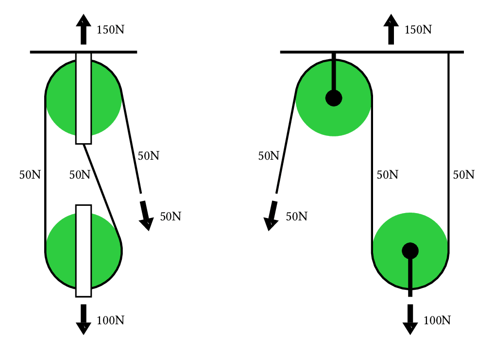 |  |
| [Harmonic Oscillator Energy vs inverse Temperature](https://janosh.github.io/diagrams/harmonic-oscillator-energy-vs-inv-temp) &nbsp;[![LaTeX][latex-logo]](assets/harmonic-oscillator-energy-vs-inv-temp/harmonic-oscillator-energy-vs-inv-temp.tex)&nbsp;[![Typst][typst-logo]](assets/harmonic-oscillator-energy-vs-inv-temp/harmonic-oscillator-energy-vs-inv-temp.typ) | [Heatmap](https://janosh.github.io/diagrams/heatmap) &nbsp;[![LaTeX][latex-logo]](assets/heatmap/heatmap.tex)&nbsp;[![Typst][typst-logo]](assets/heatmap/heatmap.typ) |
|  |  |
| [Higgs Potential](https://janosh.github.io/diagrams/higgs-potential) &nbsp;[![LaTeX][latex-logo]](assets/higgs-potential/higgs-potential.tex) | [High Entropy Alloy](https://janosh.github.io/diagrams/high-entropy-alloy) &nbsp;[![LaTeX][latex-logo]](assets/high-entropy-alloy/high-entropy-alloy.tex)&nbsp;[![Typst][typst-logo]](assets/high-entropy-alloy/high-entropy-alloy.typ) |
|  |  |
| [In-Flight Auto-Batcher](https://janosh.github.io/diagrams/in-flight-auto-batcher) &nbsp;[![Typst][typst-logo]](assets/in-flight-auto-batcher/in-flight-auto-batcher.typ) | [Isotherms](https://janosh.github.io/diagrams/isotherms) &nbsp;[![LaTeX][latex-logo]](assets/isotherms/isotherms.tex)&nbsp;[![Typst][typst-logo]](assets/isotherms/isotherms.typ) |
| 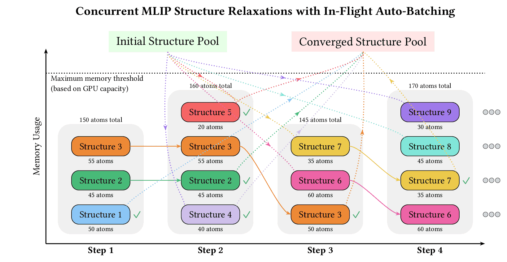 |  |
| [Jensens Inequality](https://janosh.github.io/diagrams/jensens-inequality) &nbsp;[![LaTeX][latex-logo]](assets/jensens-inequality/jensens-inequality.tex)&nbsp;[![Typst][typst-logo]](assets/jensens-inequality/jensens-inequality.typ) | [k-Nearest Neighbors](https://janosh.github.io/diagrams/k-nearest-neighbors) &nbsp;[![Typst][typst-logo]](assets/k-nearest-neighbors/k-nearest-neighbors.typ) |
|  | 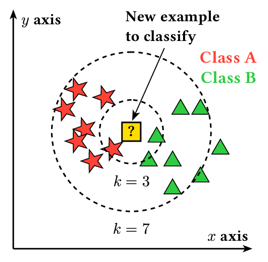 |
| [k-Space](https://janosh.github.io/diagrams/k-space) &nbsp;[![LaTeX][latex-logo]](assets/k-space/k-space.tex)&nbsp;[![Typst][typst-logo]](assets/k-space/k-space.typ) | [Kohn Sham Cycle](https://janosh.github.io/diagrams/kohn-sham-cycle) &nbsp;[![LaTeX][latex-logo]](assets/kohn-sham-cycle/kohn-sham-cycle.tex)&nbsp;[![Typst][typst-logo]](assets/kohn-sham-cycle/kohn-sham-cycle.typ) |
|  |  |
| [Light](https://janosh.github.io/diagrams/light) &nbsp;[![Typst][typst-logo]](assets/light/light.typ) | [M-Theory](https://janosh.github.io/diagrams/m-theory) &nbsp;[![LaTeX][latex-logo]](assets/m-theory/m-theory.tex) |
|  |  |
| [MADE](https://janosh.github.io/diagrams/made) &nbsp;[![LaTeX][latex-logo]](assets/made/made.tex)&nbsp;[![Typst][typst-logo]](assets/made/made.typ) | [Masked Autoregressive Flow](https://janosh.github.io/diagrams/masked-autoregressive-flow) &nbsp;[![LaTeX][latex-logo]](assets/masked-autoregressive-flow/masked-autoregressive-flow.tex)&nbsp;[![Typst][typst-logo]](assets/masked-autoregressive-flow/masked-autoregressive-flow.typ) |
|  |  |
| [Materials Informatics](https://janosh.github.io/diagrams/materials-informatics) &nbsp;[![LaTeX][latex-logo]](assets/materials-informatics/materials-informatics.tex)&nbsp;[![Typst][typst-logo]](assets/materials-informatics/materials-informatics.typ) | [Materials Informatics Challenges](https://janosh.github.io/diagrams/materials-informatics-challenges) &nbsp;[![LaTeX][latex-logo]](assets/materials-informatics-challenges/materials-informatics-challenges.tex) |
|  |  |
| [Matsubara Contour 1](https://janosh.github.io/diagrams/matsubara-contour-1) &nbsp;[![LaTeX][latex-logo]](assets/matsubara-contour-1/matsubara-contour-1.tex)&nbsp;[![Typst][typst-logo]](assets/matsubara-contour-1/matsubara-contour-1.typ) | [Matsubara Contour 2](https://janosh.github.io/diagrams/matsubara-contour-2) &nbsp;[![LaTeX][latex-logo]](assets/matsubara-contour-2/matsubara-contour-2.tex)&nbsp;[![Typst][typst-logo]](assets/matsubara-contour-2/matsubara-contour-2.typ) |
|  |  |
| [Matsubara Contour 3](https://janosh.github.io/diagrams/matsubara-contour-3) &nbsp;[![LaTeX][latex-logo]](assets/matsubara-contour-3/matsubara-contour-3.tex)&nbsp;[![Typst][typst-logo]](assets/matsubara-contour-3/matsubara-contour-3.typ) | [Matsubara Contour 4](https://janosh.github.io/diagrams/matsubara-contour-4) &nbsp;[![LaTeX][latex-logo]](assets/matsubara-contour-4/matsubara-contour-4.tex)&nbsp;[![Typst][typst-logo]](assets/matsubara-contour-4/matsubara-contour-4.typ) |
|  |  |
| [Matsubara Contour 5](https://janosh.github.io/diagrams/matsubara-contour-5) &nbsp;[![LaTeX][latex-logo]](assets/matsubara-contour-5/matsubara-contour-5.tex)&nbsp;[![Typst][typst-logo]](assets/matsubara-contour-5/matsubara-contour-5.typ) | [Matsubara Contour Deformation](https://janosh.github.io/diagrams/matsubara-contour-deformation) &nbsp;[![LaTeX][latex-logo]](assets/matsubara-contour-deformation/matsubara-contour-deformation.tex) |
|  |  |
| [Maxwell Boltzmann Distribution](https://janosh.github.io/diagrams/maxwell-boltzmann-distribution) &nbsp;[![LaTeX][latex-logo]](assets/maxwell-boltzmann-distribution/maxwell-boltzmann-distribution.tex)&nbsp;[![Typst][typst-logo]](assets/maxwell-boltzmann-distribution/maxwell-boltzmann-distribution.typ) | [Mexican Hat](https://janosh.github.io/diagrams/mexican-hat) &nbsp;[![LaTeX][latex-logo]](assets/mexican-hat/mexican-hat.tex) |
|  |  |
| [ML Activations](https://janosh.github.io/diagrams/ml-activations) &nbsp;[![Typst][typst-logo]](assets/ml-activations/ml-activations.typ) | [Momentum Shell](https://janosh.github.io/diagrams/momentum-shell) &nbsp;[![LaTeX][latex-logo]](assets/momentum-shell/momentum-shell.tex)&nbsp;[![Typst][typst-logo]](assets/momentum-shell/momentum-shell.typ) |
|  |  |
| [MOSFET](https://janosh.github.io/diagrams/mosfet) &nbsp;[![LaTeX][latex-logo]](assets/mosfet/mosfet.tex)&nbsp;[![Typst][typst-logo]](assets/mosfet/mosfet.typ) | [NMOSFET Amplifier Circuit](https://janosh.github.io/diagrams/nmosfet-amplifier-circuit) &nbsp;[![Typst][typst-logo]](assets/nmosfet-amplifier-circuit/nmosfet-amplifier-circuit.typ) |
|  | 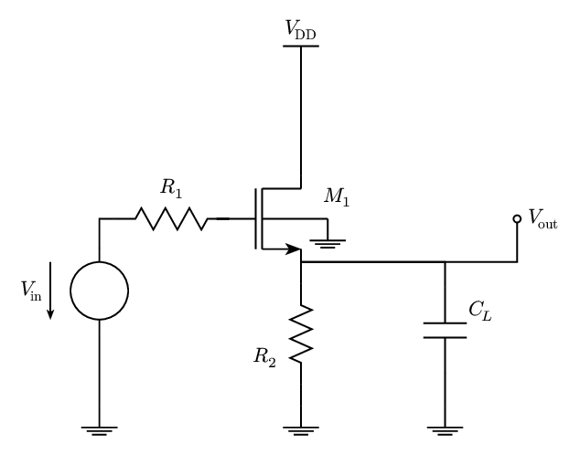 |
| [Normalizing Flow](https://janosh.github.io/diagrams/normalizing-flow) &nbsp;[![LaTeX][latex-logo]](assets/normalizing-flow/normalizing-flow.tex)&nbsp;[![Typst][typst-logo]](assets/normalizing-flow/normalizing-flow.typ) | [Normalizing Flow Coupling Layer](https://janosh.github.io/diagrams/normalizing-flow-coupling-layer) &nbsp;[![LaTeX][latex-logo]](assets/normalizing-flow-coupling-layer/normalizing-flow-coupling-layer.tex)&nbsp;[![Typst][typst-logo]](assets/normalizing-flow-coupling-layer/normalizing-flow-coupling-layer.typ) |
|  |  |
| [Open String Topologies](https://janosh.github.io/diagrams/open-string-topologies) &nbsp;[![LaTeX][latex-logo]](assets/open-string-topologies/open-string-topologies.tex) | [Operator Orderings](https://janosh.github.io/diagrams/operator-orderings) &nbsp;[![LaTeX][latex-logo]](assets/operator-orderings/operator-orderings.tex) |
|  |  |
| [Organic Molecule](https://janosh.github.io/diagrams/organic-molecule) &nbsp;[![LaTeX][latex-logo]](assets/organic-molecule/organic-molecule.tex)&nbsp;[![Typst][typst-logo]](assets/organic-molecule/organic-molecule.typ) | [Otto Cycle](https://janosh.github.io/diagrams/otto-cycle) &nbsp;[![LaTeX][latex-logo]](assets/otto-cycle/otto-cycle.tex)&nbsp;[![Typst][typst-logo]](assets/otto-cycle/otto-cycle.typ) |
|  |  |
| [Periodic Table](https://janosh.github.io/diagrams/periodic-table) &nbsp;[![LaTeX][latex-logo]](assets/periodic-table/periodic-table.tex)&nbsp;[![Typst][typst-logo]](assets/periodic-table/periodic-table.typ) | [Physics Mindmap](https://janosh.github.io/diagrams/physics-mindmap) &nbsp;[![LaTeX][latex-logo]](assets/physics-mindmap/physics-mindmap.tex) |
|  |  |
| [Plane to Torus](https://janosh.github.io/diagrams/plane-to-torus) &nbsp;[![LaTeX][latex-logo]](assets/plane-to-torus/plane-to-torus.tex) | [Plate Capacitor](https://janosh.github.io/diagrams/plate-capacitor) &nbsp;[![LaTeX][latex-logo]](assets/plate-capacitor/plate-capacitor.tex)&nbsp;[![Typst][typst-logo]](assets/plate-capacitor/plate-capacitor.typ) |
|  |  |
| [Potential Triangle](https://janosh.github.io/diagrams/potential-triangle) &nbsp;[![LaTeX][latex-logo]](assets/potential-triangle/potential-triangle.tex)&nbsp;[![Typst][typst-logo]](assets/potential-triangle/potential-triangle.typ) | [Propagator Fluctuations](https://janosh.github.io/diagrams/propagator-fluctuations) &nbsp;[![LaTeX][latex-logo]](assets/propagator-fluctuations/propagator-fluctuations.tex)&nbsp;[![Typst][typst-logo]](assets/propagator-fluctuations/propagator-fluctuations.typ) |
|  |  |
| [QFT Propagator Poles](https://janosh.github.io/diagrams/qft-propagator-poles) &nbsp;[![LaTeX][latex-logo]](assets/qft-propagator-poles/qft-propagator-poles.tex)&nbsp;[![Typst][typst-logo]](assets/qft-propagator-poles/qft-propagator-poles.typ) | [QFT Propagators](https://janosh.github.io/diagrams/qft-propagators) &nbsp;[![LaTeX][latex-logo]](assets/qft-propagators/qft-propagators.tex)&nbsp;[![Typst][typst-logo]](assets/qft-propagators/qft-propagators.typ) |
|  |  |
| [Cost vs Accuracy in Quantum Mechanical Simulations](https://janosh.github.io/diagrams/qm-cost-vs-acc) &nbsp;[![LaTeX][latex-logo]](assets/qm-cost-vs-acc/qm-cost-vs-acc.tex)&nbsp;[![Typst][typst-logo]](assets/qm-cost-vs-acc/qm-cost-vs-acc.typ) | [Random Forest](https://janosh.github.io/diagrams/random-forest) &nbsp;[![LaTeX][latex-logo]](assets/random-forest/random-forest.tex)&nbsp;[![Typst][typst-logo]](assets/random-forest/random-forest.typ) |
|  |  |
| [Regular vs Bayes NN](https://janosh.github.io/diagrams/regular-vs-bayes-nn) &nbsp;[![LaTeX][latex-logo]](assets/regular-vs-bayes-nn/regular-vs-bayes-nn.tex)&nbsp;[![Typst][typst-logo]](assets/regular-vs-bayes-nn/regular-vs-bayes-nn.typ) | [RG Flow in Theory Space](https://janosh.github.io/diagrams/rg-flow-in-theory-space) &nbsp;[![LaTeX][latex-logo]](assets/rg-flow-in-theory-space/rg-flow-in-theory-space.tex)&nbsp;[![Typst][typst-logo]](assets/rg-flow-in-theory-space/rg-flow-in-theory-space.typ) |
|  |  |
| [Risk-Opportunity Matrix](https://janosh.github.io/diagrams/risk-opportunity-matrix) &nbsp;[![Typst][typst-logo]](assets/risk-opportunity-matrix/risk-opportunity-matrix.typ) | [RNVP Affine Coupling Layer](https://janosh.github.io/diagrams/rnvp-affine-coupling-layer) &nbsp;[![LaTeX][latex-logo]](assets/rnvp-affine-coupling-layer/rnvp-affine-coupling-layer.tex)&nbsp;[![Typst][typst-logo]](assets/rnvp-affine-coupling-layer/rnvp-affine-coupling-layer.typ) |
|  |  |
| [ROC Curve](https://janosh.github.io/diagrams/roc-curve) &nbsp;[![Typst][typst-logo]](assets/roc-curve/roc-curve.typ) | [Roost Update](https://janosh.github.io/diagrams/roost-update) &nbsp;[![LaTeX][latex-logo]](assets/roost-update/roost-update.tex) |
| 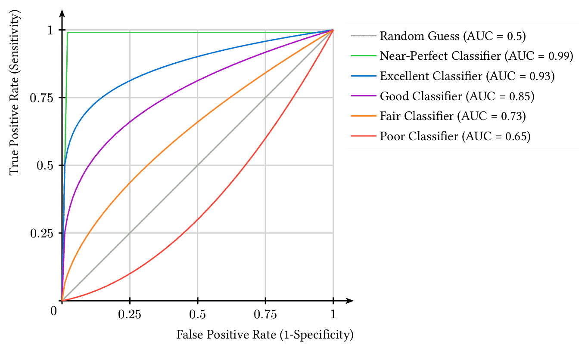 |  |
| [Sabatier Principle](https://janosh.github.io/diagrams/sabatier-principle) &nbsp;[![LaTeX][latex-logo]](assets/sabatier-principle/sabatier-principle.tex)&nbsp;[![Typst][typst-logo]](assets/sabatier-principle/sabatier-principle.typ) | [Saddle Point](https://janosh.github.io/diagrams/saddle-point) &nbsp;[![LaTeX][latex-logo]](assets/saddle-point/saddle-point.tex)&nbsp;[![Typst][typst-logo]](assets/saddle-point/saddle-point.typ) |
|  |  |
| [Scattering Detailed Balance](https://janosh.github.io/diagrams/scattering-detailed-balance) &nbsp;[![LaTeX][latex-logo]](assets/scattering-detailed-balance/scattering-detailed-balance.tex)&nbsp;[![Typst][typst-logo]](assets/scattering-detailed-balance/scattering-detailed-balance.typ) | [Seebeck Effect](https://janosh.github.io/diagrams/seebeck-effect) &nbsp;[![LaTeX][latex-logo]](assets/seebeck-effect/seebeck-effect.tex) |
|  |  |
| [Self Attention](https://janosh.github.io/diagrams/self-attention) &nbsp;[![LaTeX][latex-logo]](assets/self-attention/self-attention.tex)&nbsp;[![Typst][typst-logo]](assets/self-attention/self-attention.typ) | [Sierpinski Triangle](https://janosh.github.io/diagrams/sierpinski-triangle) &nbsp;[![Typst][typst-logo]](assets/sierpinski-triangle/sierpinski-triangle.typ) |
|  | 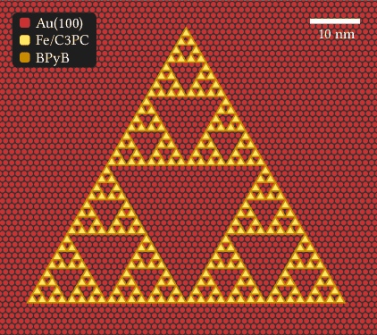 |
| [Single-head attention](https://janosh.github.io/diagrams/single-head-attention) &nbsp;[![LaTeX][latex-logo]](assets/single-head-attention/single-head-attention.tex)&nbsp;[![Typst][typst-logo]](assets/single-head-attention/single-head-attention.typ) | [Skip Connection](https://janosh.github.io/diagrams/skip-connection) &nbsp;[![LaTeX][latex-logo]](assets/skip-connection/skip-connection.tex)&nbsp;[![Typst][typst-logo]](assets/skip-connection/skip-connection.typ) |
|  |  |
| [Spontaneous Magnetization](https://janosh.github.io/diagrams/spontaneous-magnetization) &nbsp;[![LaTeX][latex-logo]](assets/spontaneous-magnetization/spontaneous-magnetization.tex)&nbsp;[![Typst][typst-logo]](assets/spontaneous-magnetization/spontaneous-magnetization.typ) | [Statistical Energy Distributions](https://janosh.github.io/diagrams/statistical-energy-distributions) &nbsp;[![LaTeX][latex-logo]](assets/statistical-energy-distributions/statistical-energy-distributions.tex)&nbsp;[![Typst][typst-logo]](assets/statistical-energy-distributions/statistical-energy-distributions.typ) |
|  |  |
| [Sublattice Points](https://janosh.github.io/diagrams/sublattice-points) &nbsp;[![Typst][typst-logo]](assets/sublattice-points/sublattice-points.typ) | [Tanh](https://janosh.github.io/diagrams/tanh) &nbsp;[![LaTeX][latex-logo]](assets/tanh/tanh.tex)&nbsp;[![Typst][typst-logo]](assets/tanh/tanh.typ) |
|  |  |
| [Thermodynamic Ensemble transforms](https://janosh.github.io/diagrams/thermo-ensemble-trafos) &nbsp;[![LaTeX][latex-logo]](assets/thermo-ensemble-trafos/thermo-ensemble-trafos.tex)&nbsp;[![Typst][typst-logo]](assets/thermo-ensemble-trafos/thermo-ensemble-trafos.typ) | [Thermodynamic Potentials Venn Diagram](https://janosh.github.io/diagrams/thermodynamic-potentials-venn-diagram) &nbsp;[![Typst][typst-logo]](assets/thermodynamic-potentials-venn-diagram/thermodynamic-potentials-venn-diagram.typ) |
|  |  |
| [Thomson Scattering](https://janosh.github.io/diagrams/thomson-scattering) &nbsp;[![LaTeX][latex-logo]](assets/thomson-scattering/thomson-scattering.tex) | [Timed Event Graph](https://janosh.github.io/diagrams/timed-event-graph) &nbsp;[![Typst][typst-logo]](assets/timed-event-graph/timed-event-graph.typ) |
|  | 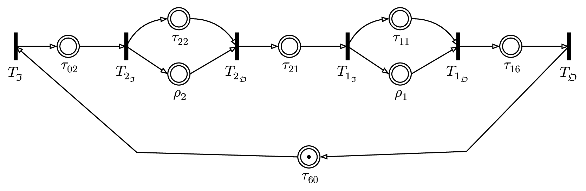 |
| [Tori](https://janosh.github.io/diagrams/tori) &nbsp;[![LaTeX][latex-logo]](assets/tori/tori.tex) | [Torus](https://janosh.github.io/diagrams/torus) &nbsp;[![LaTeX][latex-logo]](assets/torus/torus.tex) |
|  |  |
| [Torus Fundamental Domain](https://janosh.github.io/diagrams/torus-fundamental-domain) &nbsp;[![LaTeX][latex-logo]](assets/torus-fundamental-domain/torus-fundamental-domain.tex)&nbsp;[![Typst][typst-logo]](assets/torus-fundamental-domain/torus-fundamental-domain.typ) | [Train-Test Split](https://janosh.github.io/diagrams/train-test-split) &nbsp;[![Typst][typst-logo]](assets/train-test-split/train-test-split.typ) |
|  | 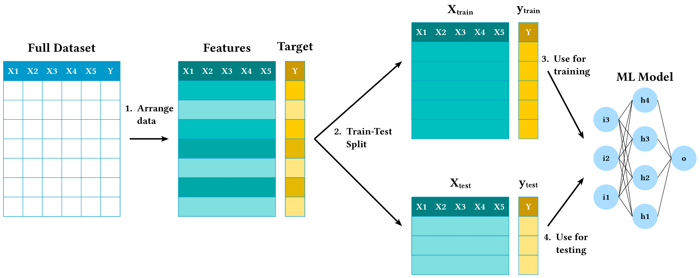 |
| [Two Point No Cutoff](https://janosh.github.io/diagrams/two-point-no-cutoff) &nbsp;[![LaTeX][latex-logo]](assets/two-point-no-cutoff/two-point-no-cutoff.tex)&nbsp;[![Typst][typst-logo]](assets/two-point-no-cutoff/two-point-no-cutoff.typ) | [Two-point Propagator Flow](https://janosh.github.io/diagrams/two-point-propagator-flow) &nbsp;[![LaTeX][latex-logo]](assets/two-point-propagator-flow/two-point-propagator-flow.tex)&nbsp;[![Typst][typst-logo]](assets/two-point-propagator-flow/two-point-propagator-flow.typ) |
|  |  |
| [Unregularized Propagator Diagrams](https://janosh.github.io/diagrams/unregularized-propagator-diagrams) &nbsp;[![LaTeX][latex-logo]](assets/unregularized-propagator-diagrams/unregularized-propagator-diagrams.tex)&nbsp;[![Typst][typst-logo]](assets/unregularized-propagator-diagrams/unregularized-propagator-diagrams.typ) | [Variational Autoencoder](https://janosh.github.io/diagrams/variational-autoencoder) &nbsp;[![LaTeX][latex-logo]](assets/variational-autoencoder/variational-autoencoder.tex)&nbsp;[![Typst][typst-logo]](assets/variational-autoencoder/variational-autoencoder.typ) |
|  |  |
| [Wetterich Equation](https://janosh.github.io/diagrams/wetterich-equation) &nbsp;[![LaTeX][latex-logo]](assets/wetterich-equation/wetterich-equation.tex)&nbsp;[![Typst][typst-logo]](assets/wetterich-equation/wetterich-equation.typ) | [Wyckoff Positions](https://janosh.github.io/diagrams/wyckoff-positions) &nbsp;[![LaTeX][latex-logo]](assets/wyckoff-positions/wyckoff-positions.tex)&nbsp;[![Typst][typst-logo]](assets/wyckoff-positions/wyckoff-positions.typ) |
|  |  |
| [zT vs n](https://janosh.github.io/diagrams/zt-vs-n) &nbsp;[![LaTeX][latex-logo]](assets/zt-vs-n/zt-vs-n.tex)&nbsp;[![Typst][typst-logo]](assets/zt-vs-n/zt-vs-n.typ) |  |
|  |  |

## Scripts

Files in [`/scripts`](scripts) render and convert the `.typ` and `.tex` files in [`/assets`](assets) to various formats:

- low + high-res PNG
- PDF
- SVG

To run the scripts requires the following dependencies:

- [`pdf-compressor`](https://github.com/janosh/pdf-compressor) (`pip install pdf-compressor`)
- [`gs` (GhostScript)](https://ghostscript.com) (optional, worse compression but needs no API key so less setup than `pdf-compressor`)
- [`pdf2svg`](https://github.com/dawbarton/pdf2svg) (`brew install pdf2svg`)
- `convert` (part of [ImageMagick](https://imagemagick.org/script))
- [`pngquant`](https://github.com/kornelski/pngquant) (`brew install pngquant`)
- [`zopflipng`](https://github.com/google/zopfli) (`brew install zopfli`)

To run `pdf-compressor` directly or to use it as part of the [`render-(typst|tikz).py`](scripts/render_typst.py) pipeline, you need a free public API key from <https://developer.ilovepdf.com>. Pass it to `pdf-compressor` with:

```sh
pdf-compressor --set-api-key project_public_7c854a9db0...
```

## 📖 &thinsp; How to cite

You can cite the [Zenodo record](https://zenodo.org/badge/latestdoi/286220365) using the following BibTeX entry:

```bib
@software{riebesell_diagrams_2020,
  title = {Collection of scientific diagrams},
  author = {Riebesell, Janosh and Bringuier, Stefan},
  date = {2020-08-09},
  year = {2020},
  doi = {10.5281/zenodo.7486911},
  url = {https://github.com/janosh/diagrams},
  note = {10.5281/zenodo.7486911 - https://github.com/janosh/diagrams},
  version = {0.2.0},
  urldate = {2023-01-01}, % optional, replace with your date of access
}
```

<!-- see https://iconify.design/docs/api/svg.html#dimensions for query param docs-->

[typst-logo]: https://api.iconify.design/simple-icons:typst.svg?color=white&height=16 "Open this diagram's Typst code"
[latex-logo]: https://api.iconify.design/simple-icons:latex.svg?color=white&height=16 "Open this diagram's LaTeX code"
